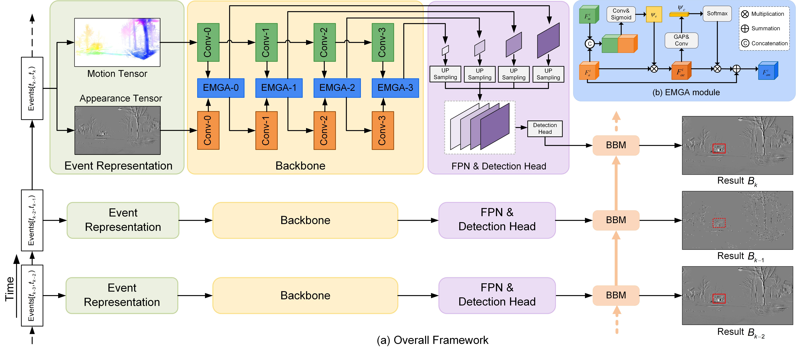

# MAD: Motion and Appearance Decoupling representation for Event Cameras

This is the official Pytorch implementation of the paper MAD: Motion and Appearance Decoupling representation for  Event Cameras.

# Visualization on different tasks
## Object Detection
gif

## Semantic Segmentation
gif
## Human Pose Estimation
gif

# Installation
## Conda
    conda create -y -n mad python=3.9 
    conda activate mad
    conda install --file requirements.txt

## Required Data
### Download
The download addresses for the data are as follows:

| TASK                  | dataset_0 | dataset_1     |
|-----------------------|-----------|---------------|
| Object detection      |[ Gen 1](https://www.prophesee.ai/2020/01/24/prophesee-gen1-automotive-detection-dataset/)| [ 1Mpx ](https://www.prophesee.ai/2020/11/24/automotive-megapixel-event-based-dataset/)          |
| Semantic Segmentation | [ DDD17](https://docs.google.com/document/d/1HM0CSmjO8nOpUeTvmPjopcBcVCk7KXvLUuiZFS6TWSg/pub)      | [ DSEC-Semantic](https://dsec.ifi.uzh.ch/) |
| Human Pose Estimation | [ DHP19](https://dsec.ifi.uzh.ch/)     | -             |

### Preprocess
 You need to preprocess the original event data to fit our code. For object detection and semantic segmentation tasks, we divide the data at 50ms intervals; for human pose estimation tasks, we divide the data at intervals of every 7,500 events.
For xx dataset, you can run:
	
	python builddataset/build_xx.py
	
For example, to preprocess a 1mpx dataset, you can run the following code:

	python builddataset/build_1mpx.py

## Pre-trained Checkpoints for MAD representation
| TASK                  | dataset_0 | dataset_1     |
|-----------------------|-----------|---------------|
| Object detection      |[ Gen 1](https://www.prophesee.ai/2020/01/24/prophesee-gen1-automotive-detection-dataset/)| [ 1Mpx ](https://www.prophesee.ai/2020/11/24/automotive-megapixel-event-based-dataset/)          |
| Semantic Segmentation | [ DDD17](https://docs.google.com/document/d/1HM0CSmjO8nOpUeTvmPjopcBcVCk7KXvLUuiZFS6TWSg/pub)      | [ DSEC-Semantic](https://dsec.ifi.uzh.ch/) |
| Human Pose Estimation | [ DHP19](https://dsec.ifi.uzh.ch/)     | -             |

## Train
Coming soon

## Test
We currently provide MAD representation testing and visualization code. You can run the following code to visualize the results of MAD representation.

	python pre_xx.py

For example, to preprocess a 1mpx dataset, you can run the following code:

	python pre_1mpx.py
